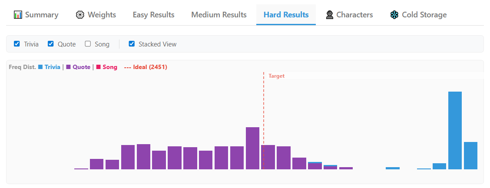
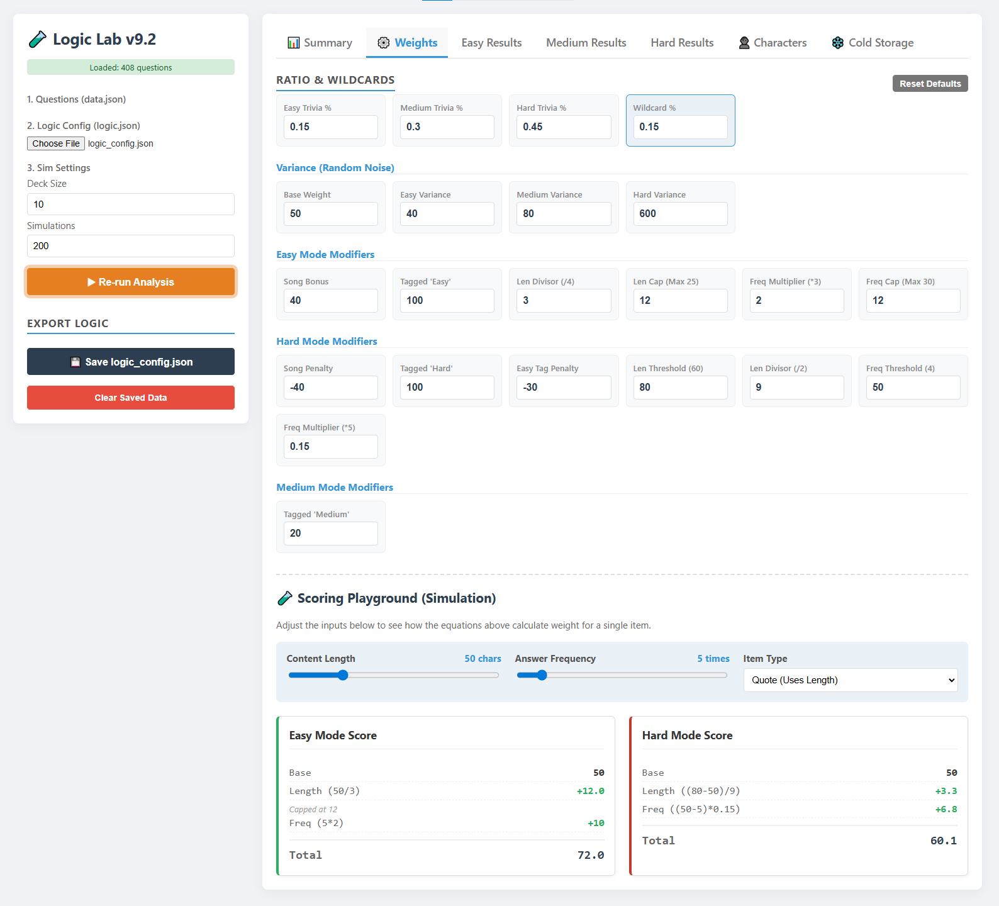

# Logic Lab: Monte Carlo Simulation & Process Control Tool

**[Live Demo: Launch Logic Lab Analysis Tool](https://joeysalmons.github.io/logic-lab-analytics/)**
*(Note: Load the included JSON files from the repository to visualize the data)*

## Project Overview
Logic Lab is a client-side simulation engine designed to analyze, visualize, and control variance in stochastic systems. Originally built to balance difficulty distribution for a 400-item quiz database, the tool utilizes Monte Carlo simulations to model long-term outcomes and identify statistical anomalies.

This project demonstrates core process engineering concepts: **input validation**, **variance control**, **yield optimization**, and **data visualization**.

## Key Features

*   **Monte Carlo Engine:** Runs thousands of iterations to predict content selection frequency, moving beyond simple probability to account for complex, interacting constraints.
*   **Input "Sanity Check":** Automated pre-processing pipeline that flags duplicates, missing fields, and invalid data types before simulation begins.
*   **Dynamic Weighting Logic:** A tunable logic engine that adjusts selection probability based on item attributes (Length, Rarity, Tags) to normalize distribution.
*   **"Cold Storage" Detection:** Identifies under-utilized inventory (questions that statistically never appear) to improve total pool efficiency.

## Analysis: Supply vs. Demand Mismatch
One of the key engineering challenges solved by this tool was balancing "Hard Mode" selection.

*Figure 1: Distribution Analysis of Hard Mode selection.*

As seen in the frequency histogram above, the simulation revealed a bimodal distribution (two distinct peaks). 
1.  **The Cause:** The logic configuration "demanded" a high ratio of Trivia questions, but the source dataset ("Supply") was heavily skewed toward Quotes.
2.  **The Result:** To meet the logic targets, the algorithm was forced to over-sample the limited Trivia pool (Right Peak) while under-sampling the abundant Quotes pool (Left Distribution).
3.  **The Benefit:** This visualization allowed for rapid parameter tuning to align the "process requirements" (Logic) with the "raw materials" (Data).

## Logic Configuration

*Figure 2: The interactive weighting interface for controlling variance.*

## Logic Architecture: How it Works

Unlike simple "raffle" systems, Logic Lab uses a **Ranking & Noise** algorithm to ensure quality control while maintaining variety.

1.  **Scoring:** Every question starts with a Base Weight (50).
2.  **Modifiers:** The engine applies bonuses/penalties based on attributes (e.g., +10 for 'Easy', -5 for 'Long Text').
3.  **Variance (Noise Injection):** A random value (0-N) is added to the score to prevent the quiz from being identical every time.
4.  **Selection:** The pool is sorted by Final Score, and the top N items are selected.

*This approach allows the "Variance" slider to act as a direct control for replayability vs. quality enforcement.*

## Tech Stack
*   **Core:** HTML5 / JavaScript (ES6+)
*   **Data:** JSON
*   **Visualization:** CSS Grid / Custom Charting Logic
